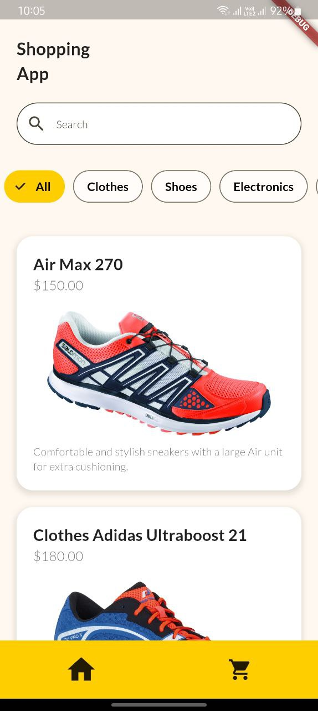

# Shopping App

A Flutter-based shopping app with features for browsing products, viewing product details, adding items to the cart, and more. This app allows users to explore different categories, search for products, and manage their shopping cart.

## Features

- **Browse Products:** View a list of products categorized by type.
- **Product Details:** See detailed information about each product.
- **Add to Cart:** Add products to the shopping cart.
- **Cart Management:** View and manage items in the cart.
- **Persistent Cart:** Save cart items so they remain even after closing the app.
- **Responsive UI:** Works well on various screen sizes.

## Usage

1. **Browse Categories:** Use the filter options to browse products by category.
2. **Search Products:** Type in the search bar to find specific products.
3. **View Product Details:** Tap on a product to see more details.
4. **Add to Cart:** Use the "Add to Cart" button on the product page.
5. **Manage Cart:** Access the cart to view and manage items.

## Screenshots

Here are some screenshots of the app in action:

### Home Screen

### Product Page

### Cart Page

## Contributing

If you'd like to contribute to this project, please fork the repository and submit a pull request. For major changes, please open an issue first to discuss what you would like to change.

## Acknowledgements

- Flutter - for the framework.
- Dart - for the programming language.
- Material Design - for the design guidelines.

---
